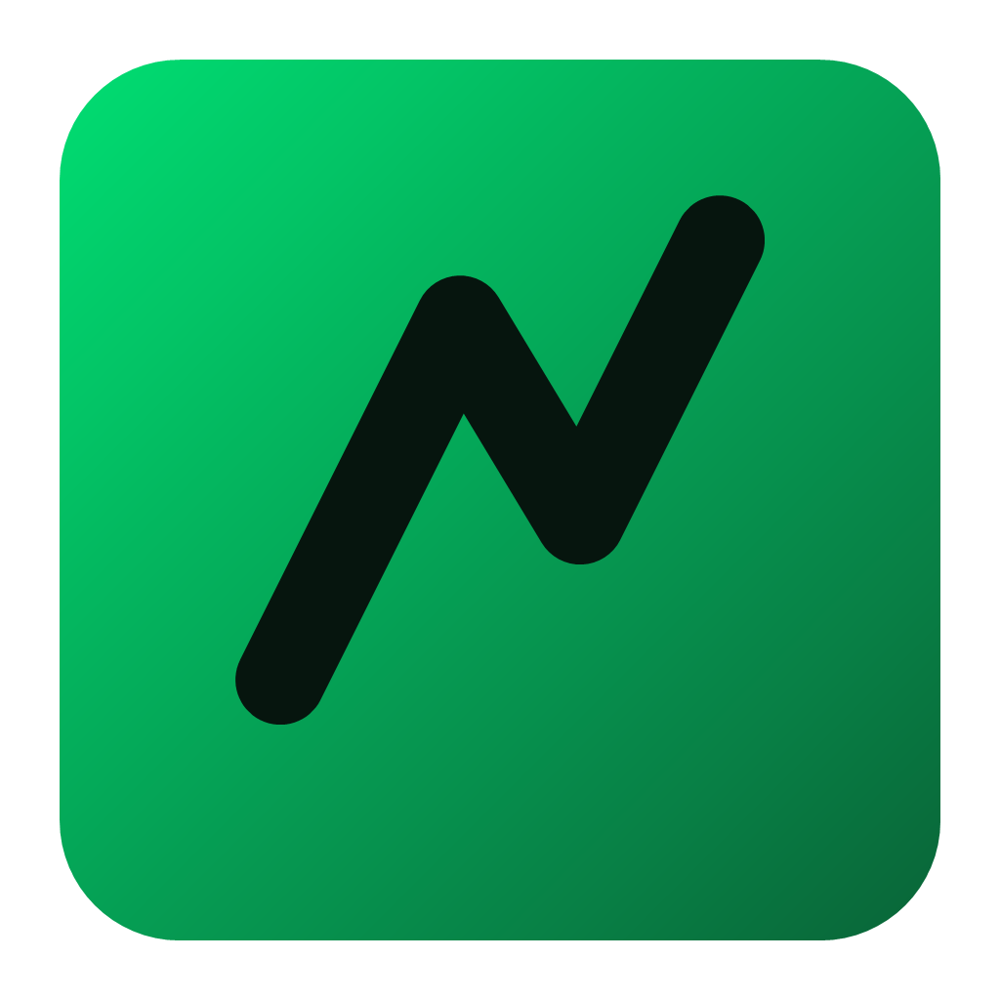

  

  <a href="https://hoodwise.xyz"><strong>Explore Hoodwise ↗</strong></a>
  &nbsp;&nbsp;·&nbsp;&nbsp;
  <a href="#the-signal"><strong>The signal</strong></a>
  &nbsp;&nbsp;·&nbsp;&nbsp;
  <a href="#under-the-hood"><strong>Under the hood</strong></a>

<h1 align="center">Chain intelligence, without the noise.</h1>

  Hoodwise is an independent, source-grounded guide to Robinhood Chain. 
  Clear context for the products, infrastructure, ecosystem, and risks that matter.

  
  

  

## The signal

Hoodwise turns a fast-moving chain into a briefing you can actually use. Ask a direct question, follow the source links, and stay oriented without digging through a dozen tabs.

| | What Hoodwise makes easier |
| --- | --- |
| **Products** | Stock Tokens, Robinhood Earn, and the practical “what does this mean?” layer. |
| **Infrastructure** | Orbit, Chainlink, DeFi, wallets, access, and how the chain fits together. |
| **Ecosystem** | Agents, experiments, culture, memes, and the trade-offs behind the headline. |
| **Risk context** | A clear distinction between structural facts, current context, and uncertainty. |

> **Independent by design.** Hoodwise is educational, not financial advice, and is not affiliated with Robinhood Markets.

## Built for a better first question

<table>
  <tr>
    <td width="56%" valign="top">
      <h3>Focused answers</h3>
      
Start with the signal, not the noise. Hoodwise keeps explanations direct and keeps the important caveats visible.

      <h3>Sources in the flow</h3>
      
Relevant answers carry source links so you can go from a quick briefing to primary context without breaking your flow.

    </td>
    <td width="44%" align="center">
      
    </td>
  </tr>
</table>

## Under the hood

The product is intentionally simple at the surface and deliberate underneath.

~~~
Question → curated chain context → optional live context → source-grounded answer
~~~

- A curated knowledge layer is the always-on source of truth.
- An optional, scoped live-search layer can supplement questions that are clearly time-sensitive.
- Conversation history is private to each anonymous browser session.
- Responses stream into a polished chat surface, with safe identity handling and source matching built in.

For the fuller product picture, see [CONTEXT.md](./CONTEXT.md), [STATUS.md](./STATUS.md), and [ROADMAP.md](./ROADMAP.md).

## A product, not a black box

| Surface | What it does |
| --- | --- |
| Landing experience | Sets the context, explains coverage, and gives users a confident starting point. |
| Briefing chat | Saves a user’s own conversation history and delivers grounded answers progressively. |
| Source layer | Matches relevant links to help users verify and continue their research. |
| Production baseline | Input validation, rate limiting, safe error handling, health checks, and automated tests. |

---

<strong>Run Hoodwise locally</strong>

 

~~~
npm install
cp .env.example .env
# Add OPENROUTER_API_KEY to .env
npm start
~~~

Open http://localhost:3000, then run npm test for the automated suite. Keep .env private; it is intentionally ignored by Git.

<strong>Deploy</strong>

 

Railway detects the Node service automatically. Set OPENROUTER_API_KEY, NODE_ENV=production, and PUBLIC_APP_URL in Railway Variables. For persistent conversation history, mount a Railway volume at /data and set DB_PATH=/data/hoodwise.db.

  Hoodwise explains how Robinhood Chain works. It is not affiliated with Robinhood Markets, and nothing here is financial advice.

